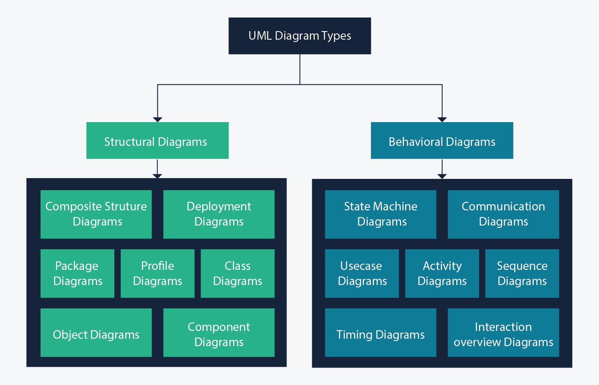
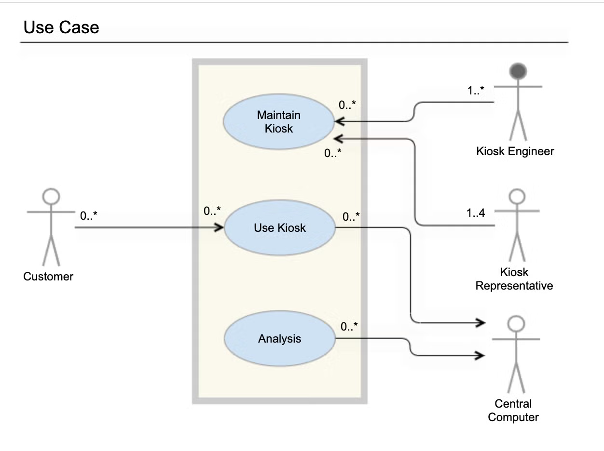
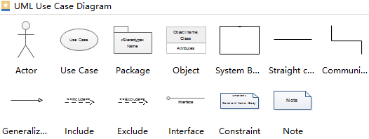
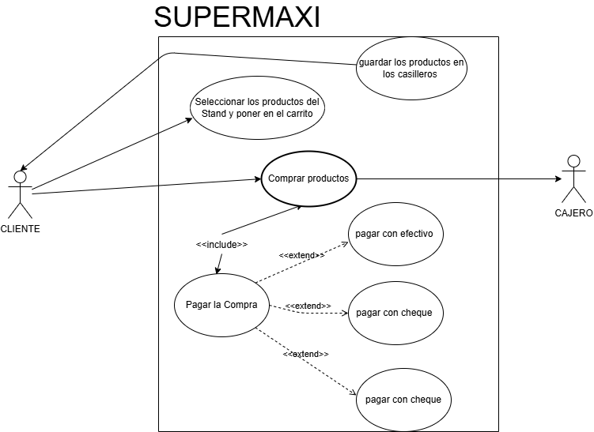
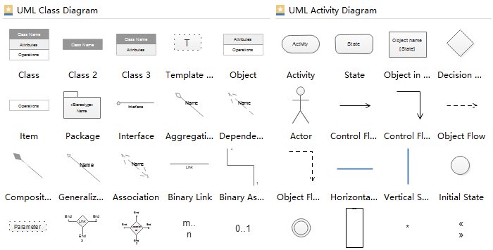

# Segundo Bimestre.
[Git de MI PROYECTO DE SEMESTRE](https://github.com/aerher/REPO_JAVA.git)
## Propiedades y Metodos de Clases

para propiedades tenemos en cada uno de las clases, propiedades que definan o que nosotros demos a entender de ese objeto a definir, como puede ser los int String, float mientras que metodos es llamas unas propiedades a mostrar sobre mi clase, es decir, hacer mi clase de una forma publica, si mis propiedades tengan restrincciones.

En propiedades, siempre va con mayusculas mientras los metodos pueden ir en minusculas siendo asi, una forma mas versatil y rapido de tipio al momento de entender los metodos y siempre tiene que tener con un verbo en infinitivo.  

la forma donde podemos mostrar un codigo, donde se puede hablar sobre el esquema de mi proyecto o de mi POO es tambien conocido como los Diagramas de UML



---
## Use Case Diagram

los diagramas de cassos de uso generalmente se desarrollan en la etapa inicial de desarrollo y las personas a menudo aplican el modelado de caso.  

**modelo stickman para el modelo del UML**
- ---> : Relacion  
- Cuadro : Dominio de Sistema  
- circulo : use case  





tambien llamado como un **actor** que puede representar :
- objeto
- Sujeto
- animal
- other objects

### Supermaxi Model for Use case Diagram  
tenemos los modelos mas comunes para un supermercado, tal que tenemos algunas funciones o realmente como funciona el sistema que manejan de compra como una marca a reconocer, como :  
- productos  
- perchas  
- perchas  
- clientes  
- casillero  
- cajero  
tal que modelando en un Use Case deberia quedar en un modelo tq  




### Creacion de UML para toma de casos y manejo de codigo mendiante grafico para mayor interacción  
en este caso, vamos a manejar el control de la EPN, como entendimiento del sistema manera de controlar y entender como fue organizado desde punto inicio, tal que en nuestros .io existe los UML encargados o dando instrucciones a seguir en nuestro codigo al entendimiento.  



## Herencia y Asociaciones  
(colocar info y grabacion 15/06 de Herencia en Teams)

Tamben utilizaro para POO, conocido como extends o Herencia es una clase **Padre** que puede compartir ciertas caracteristicas a nuevas clases en nuestros proyectos, sin que tener que reescribir las mismas caracteristicas en todas las clase o tambien llamadas ahora por **Subclases**.  

Manejandose asi, como podemos hacer que derivadas de la clase **Padre** pueda tener atributos tq, nos ayuda a tener un codigo limpio y sobretodo bien estructurado.  

para estos casos, la Herencia el Java de la denomina asi:  

``` java  
/***
 * donde la clase padre es la clase principal, por ende denominamos a la clase Hijo con extends para heredar sus atributos y caracteristicas  
 ***/
public class Hijo extends Padre { }
```
de la clase Principal, siempre llama a sus caracteristicas mediante getters and setters que estos son declaraciones para nuestra nueva clase sin necesidad de estar declarando nuevos atributos que ya disponemos.  

### Herencia
es un pilar de la Programación Orientada a Objetos (POO) que permite crear nuevas clases basadas en clases ya existentes. La nueva clase (hija) hereda los atributos y métodos de la original (padre), lo que fomenta la reutilización de código y establece relaciones jerárquicas directas.

```java
//clase padre
public class mamifero {
    int orejas;
    int trompa;
  public String amamantar() {
        System.out.println ("Esta mamando");
    }
}

```

```java
//clase hija
public class perro extends mamifero {
    int orejas;
    int trompa;
  public String amamantar() {
        System.out.println ("Esta mamando");
    }
}

```

### Asociación
 en la Programación Orientada a Objetos (POO), una asociación es una relación estructural que conecta dos o más clases. Permite que objetos independientes interactúen y colaboren entre sí para realizar tareas, sin que ninguno sea dueño del otro

```java
class Estudiante {
    private String nombre;

    public Estudiante(String nombre) {
        this.nombre = nombre;
    }

    public String getNombre() {
        return nombre;
    }
}

class Universidad {
    private String nombre;

    public Universidad(String nombre) {
        this.nombre = nombre;
    }

    public void matricular(Estudiante estudiante) {
        System.out.println(
            estudiante.getNombre() +
            " fue matriculado en " +
            nombre
        );
    }
}
```

### Interface
En Programación Orientada a Objetos (POO), una interfaz es un contrato formal que define un conjunto de métodos y propiedades que una clase debe implementar. Solo dicta qué se debe hacer, pero no cómo se hace, lo que permite que diferentes clases tengan sus propias lógicas.

```java
interface Impresora {
    void imprimir(String documento);
}

class ImpresoraLaser implements Impresora {
    @Override
    public void imprimir(String documento) {
        System.out.println("Imprimiendo en láser: " + documento);
    }
}
```

## CALSE XI: RELACIONES ENTRE CLASES

**constructor siempre lleva el mismo nombre de la clase y se usa para inicializar a los objetos (declarar variables de la clase), siempre es publico o protegido en pocos casos**


``` java
public class Perro {
private String nombre
private String raza
private String color
```

``` java
public Perro () { //1. Arranque rapido sin valores/ constructor por
defecto
super("nombre");
}
public Perro (String n, String r, String c) { //2. Arranque con todos los
valores estbelcidos
super("nombre"); //Si el papa necesita parametros para inicializar su
constructor
this.nombre = n;
this.raza = r;
this.color = c;
}
public Perro (String n){ //3. Arranque con algunos valores estabelcidos
super("nombre");
this.nombre = n;
this.color = "color";
this.raza = "raza"
}
//Solo uno de ellos se ejecutara dependiendo de los parametros que le
demos
// Creacion del objeto
Perro p = new Perro();
Perro p = new Perro("nombre", "raza"; "color");
Perro p = new Perro("nombre");
}
```

- Los atrinutos de una clase pueden establecerse con this.atributo para sus propios atributos o super.atributo para atributos de una clase de la que se heredó

- super.atributo Busca herencias superiores y en caso de haber una variable o metodo con nombre igual toma el primero que encuentra de abajo hacia arriba

- @Override sirve para sobreescribir el metodo del papa y con super se accede a los metodos del papa por si se los necesita

- Se puede heredar de un paquete a otro del mismo o diferente nivel
  
> [!NOTE]
> Todo debe estar en un mismo package.

## Asociacion

La relacion de dos clases A-B


``` java  
public class A {
public B b;
}
public class B {
public A a;
}
```

Relacion de las clases Hiena -> Buitre

``` java
public class Hiena {
public Buitre b;
}
public class Buitre {}
```

Relacion de las clases Hiena -> Buitre(7 buitres o n buitres)

``` java
public class Hiena {
public Buitre gb [7];
}
public class Buitre {}
```

Relacion de las clases SeleccionFutbol -> Jugadores(11 jugadores)

``` java  
public class SeleccionFutbol {
public Jugadores nombreEspecifico [11];
public Jugadores c;
}
public class Buitre {}
```

- Linea entrecortada sin saeta relacion de baja dependencia (podria haber asociacion)

- Linea continua con saeta especifica la relacion siempre hay q utilizar el new (debe haber asociacion)

- Rombo rellenado significa que obligatoriamente debe tener algo es decir debe esxistir new se almacena en el constructor

- Rombo no rellenado significa que no necesariamente debe tener algo y se almacena en un metodo adicional

##  ASOCIACION Y COMPOSISICON

- En UML se puede utilizar los paquetes con colores para diferneciarlos

- Utilizamos un paquete de interfaces para asignar metodos desde cualquier lugar del proyecto

- Dependecia significa que uno depende del otro para existir a eso se le llama alta dependencia

- Para definir que una clase esta asociado a muchos de otra clase se utliza:

Esto significa que el correcaminos observa al o los halcon pero el halcon no le importa el correcaminos

Una clase puede depender de otra para existir pero no viceeversa para esto de utiliza el rombo rellenado


Esto significa que el cienpies debe tener obligatoriamente una cabeza y segmentos para existir

- La linea de codigo this.(); toma todos los atributos definidos en el constructor por defecto

## EXPLICACION INTERFAZ GRAFICA

- GUI: interfaz grfica de usuario

- Lyouts: diferentes formas de ditribuir los elementos dentro de la pantalla

- Splash: ventana de entrada o de inicio para inicializar la aplicacion

- DTO: data tansference object nos permite transferir datos entre la interfaz hacia la app y despues hacia una data access


- Dichos elementos (controles) se pueden personalizar, esta personalizacion permite hacer un cambio en un escenario completo

- URL/PATH: Ruta de archivos o carpetas hay absoluta y relativa

- Absoluta: ruta completa desde el disco "C:\carpeta\archivo"

- Relativa: ruta referencial desde donde se encuentra "..\carpeta\archivo"

##  CREAR INTERFAZ GRAFICA

## Estructura de un ejemplo de Interfaz (GUI)

A continuación se detalla la responsabilidad de cada directorio y archivo dentro de la capa de interfaz gráfica:

## Paquetes y Directorios Principales

- GUI/: Paquete raíz que agrupa todos los componentes visuales y recursos de la interfaz gráfica de usuario.

- CustomerControl/: Subpaquete/módulo destinado a la gestión personalizada de controles, eventos o paneles específicos para usuarios/clientes.

- Form/: Contiene las ventanas (JFrame) y paneles (JPanel) que conforman las distintas pantallas de la aplicación.

- Resource/: Directorio dedicado a almacenar recursos estáticos y utilidades de apariencia visual.

- Icon/: Subcarpeta para almacenar iconos (archivos .png, .svg o .ico) utilizados en botones, tablas y menús.

- Img/: Subcarpeta destinada a guardar imágenes de fondo, fotografías o logotipos del sistema.

- tool/: Paquete secundario de utilidades auxiliares o helpers gráficos (reescalado de imágenes, validación de inputs, etc.).