# **CODE# Notas de clases de PROGRA II**  

## Aether / MeganHolic (Nombre de mi repositorio)
## Cuaderno de Markdown or Jupyter para toma de clases  
-apuntes de las clases paso a paso  

# Class I : Git


## Primer programa en Java
 - 461  cd ..  
 - 462  ls -la
 - 463  cd prjGit
 - 464  ls -la
 - 465  code . : para abrir mi repositorio
 - 466  touch Hi.java Sumar.java  : para crear documentos con touch  
 - 467  ls
 - 468  rm Hi.java Sumar.java  : elimine aca los dos documentos porque tenia repetidos  
 - 469  cd ..
 - 470  cd prjGithub : fui a mi repositorio a crear las nuevas clases  
 - 471  touch Hi.java Suma.java  : cree los nuevos documentos  
 - 472  cd Hi.java  
 - 473  code Hi.java  : para ingresar a mi archivo para editar  
 - 474  history : para ver mis lineas de codigo  
- 475 mkdir doc : para crear una carpeta con el siguiente nombre .  
## Mi programa de Hello World
```java

public class Hi{

    public static void main(String[] args) {
        System.out.println("Hi MeganHolic, welcome to Java programming!");
        System.out.println("Hi MeganHolic, welcome to Java programming!");
        System.out.println("Im thunder ");
        System.out.println("Im thunder ");
    }
}
```
## Mi programa de Suma en Java  

- 480  clear
- 481  code Suma.java
- 482  javac Suma.java
- 483  java Suma
- 484  java Suma
- 485  java Suma
- 486  history+
- 487  history
- $ pwd
- /c/MeganHolic/progra_two/prjGithub

```java
public class Suma{

    public static void main(String[] args) {
        int num1 = 7;
        int num2 = 770;
        int sum = num1 + num2;
        System.out.println("la suma de dos numeros " + num1 + " y " + num2 + " es: " + sum);
    }
}

```

# Class II : github
## Comandos Linux  

 - 441  ls -ña  
 - 442  ls -la  
 - 443  pwd : ubicacion de mi directorio o repositorio  
 - 444  pwd
 - 445  cd c:/ ir a una ruta con cd  
 - 446  ls -la para enlistar con archivos protegidos o ocultas
 - 447  cd MeganHolic/
 - 448  ls -la  
 - 449  wsl  llamar a la maquina virtual
 - 450  exit
 - 451  java Mate. con tab puedo ver los documentos con las caracteristicas  
 - 452  java Mate.java
 - 453  java Mate.java  
 - 454  java Mate.java
 - 455  git status
 - 456  exit
 - 457  touch readme.md
 - 458  echo "#Class II : github" >> readme.md
 - 459  code readme.md  
 - 460  history >> readme.md  

## Como contectar el repositorio con git  
480  git remote -v
 - 481  git remote set-url origin https://github.com/aerher/Prueba-Repositorio.git  : conectamos el repositorio al destinatario para guardar los siguientes git pull  
 - 482  git push -u origin main  
 - 483  git status  
 - 484  .gitignore
 - 485  code .gitignore
 - 486  git rm --cached *.class   : eliminamos los documentos que esten de mas en nuestro proyecto y validando el gitingnore
 - 487  git rm --cached *.md
 - 488  git status
 - 489  git add.   : agrego los nuevos cambios  
 - 490  git add .
 - 491  git commit -m "Eliminando los archivos del gitignore" : comento lo que realice
 - 492  git push  : subo a mi nube de Github con los cambios realizados  
 - 493  history


  ## Git comand  
  ### comandos base  
  - git clone : voy a traer un repositorio de la nube a mi maquina con su URL
  
  1 vez  
  - git init : para primera vez para darme noticias sobre mi repositorio o iniciar mi proyecto  
  - gitignore : para no registrar documentos privados
  Repetitivamente / cada dia  

  - git status :  el estado de mi repositorio
  - git add . : para agregar todo
  - git add xxx/ . : es para agregar o quitar cambios  
  - git comit -m "(podemos poner mensaje aqui para su cambio guardado)" : nombre que voy a guardar mi archivo
  
  para subir los cambios de la organizacion  
  - git push : enviar todo a mi nube de GitHub
  
  - ls -a para llamar a todos los documentos sin restrinciones  
  - cat : es para revisar documentos que esten guardados o destinados a llevar autoguardado.
  - .md : para crear documentos de texto

  # Conectar repositorios local a remoto en GITHUB
  **Secuencia de pasos a seguir para ser un repositorio totalmente solido y reconstructivo con gitHub con vs code, siendo asi la mayor forma de hacer trabajos y modificaciones en cada prj**  
  - git init  
  - git status  
  - git add .  
  - git commit -m ""
  - git push  
  - git checkout -b dev  
  - git push -u origin master : es para que git recuerde la conexion entre tu local y el remoto  
  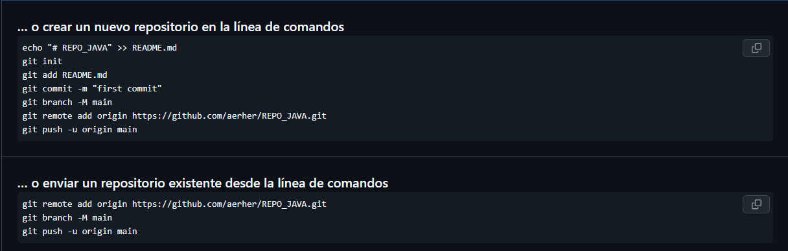
  
  ### Pero si git push no conectado a una URL  
  - git remote add origin "URL httml " : nos sirve para conectar el repositorio virtual con nuestra maquina local y se puedan hacer los push de nuestros archivos  
  - git push -u origin main : nos sirve para declarar por primera vez el update de nuestro repo a GITHU , demas con " - u " nos sirve para simplificar el hecho de repetir el " origin main " sino que solo con git push, ya nos dejaria subir nuestro repo local.  
-  
  ## Comandos para Markdown  
  - ****: es para presentacion de imagenes en un markdown y que se exporte a un pdf para presentacion formales  
  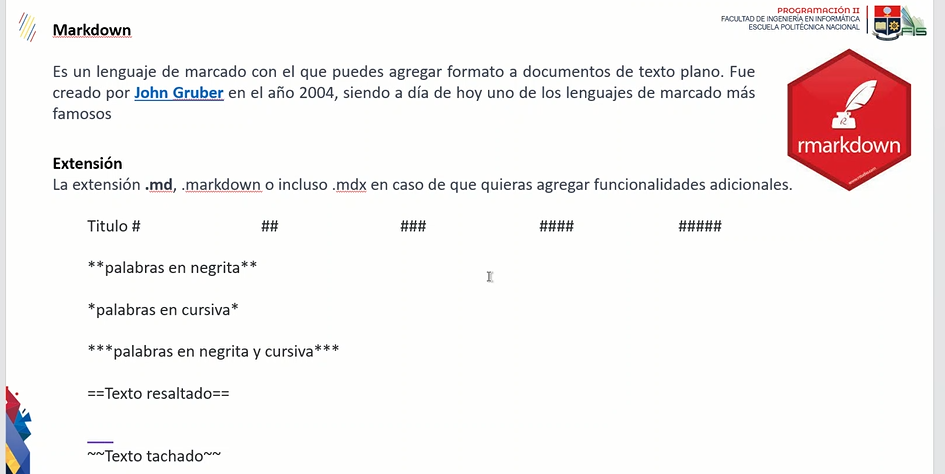

## Comandos GIT para colocar usuario y email, ademas, ver lista de usuario registrado y eliminar 

```Bash
// para registrar para un repositorio
git config --global user.name
git config --global user.email
```
```Bash
// para ver la configuracion actual
git config --global --list
```
```Bash
// para remover la configuracion local del repositorio
git config --unset user.name
git config --unset user.email
```

# Remove the globally set username
git config --global --unset user.name
# Verify removal
git config --global --list


## Actividad 13/04  
- git log -d--decorate --oneline : es para saber cuando mcomit he hecho sobre mi proyecto y ver cambios y modificaciones  
- git tag <"name ">  : es para darte una etiqueta a un commit que sea importante de todos los commit que he realizado  
-  git branch : para ver las ramas que tengo de mi git o repositorio que he ido haciendo commit  
  ## Introducion en Java

**es una de los IDE mas famosos que existe actualmente, que puede requerir para muchos problemas o resolucion de programas como paginas web , aplicaciones, etc.
una aplicacion que tiene soporte en todo el mundo, principalmente es un IDE que se orienta en su programacion en objetos.
es una buena alternativa para otros IDES que son conocidos como C ++ , etc.**
donde java si diferencia entre mayusculas y minisculas en cada prj.
**donde el lenguaje de programacion es utilizado por los humanos para comunicarnos y dar instrucciones a las maquinas**

### Regla fundamental para un archivo main.java  
```java
/// nombre del documento siendo un public class  
/// TAMBIEN CONOCIDO COMO NUESTRO PUNTO DE ENTRADA O UN PUNTO DE SALIDA  
public static void main(String[]args){
}
```

***Modelo de prj en java con sus integraciones y carpetas para un trabajo limpio***

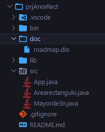

## Esqueleto De Un Programa En Java  
las primeras lineas de codigo como ejm 1 y 2, es para decalaracion de un package o una libreria a llamar, como un import.
- package : en que parte o en donde se va a agrupar mi codigo en mi repositorio. donde podemos agregar varios codigos en un mismo package y que no sea tan dificil ubicarlas entre si.  
  
 ```java  
public class Main{
  public static void main(String[]arg){
    system.out.print("Hello ThundeR");
  }  
}
```
- class : es para nombre a nuestro documento y donde se ejecuta el codigo si o si .  
- variables : caracteres que nosotros definimos en nuestro codigo como ( int, float, double, String)
- public, private, protected : Son Moderadores de acceso a nuestro codigo o en este claso nuestra clase a construir.  
- main : es el metodo principal en java, como decir el codigo a ejecutar.  
- new : es para crear en nuestro ( Main ) podemos crear un objeto de tipo de dato especifico  
-  ;  : siempre se utiliza para cerrar una linea de codigo, ya que sino da fallos en su complilacion  
-  {} : para abrir bloques de codigo en nuestro codigo e identificarlo.  
-  Puedes asignar un valor a la variable declarada mediante el operador = .
 - Una variable puede cambiar su valor durante el programa, asignándole un nuevo valor.


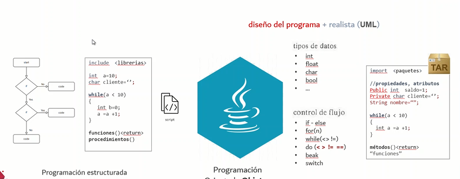


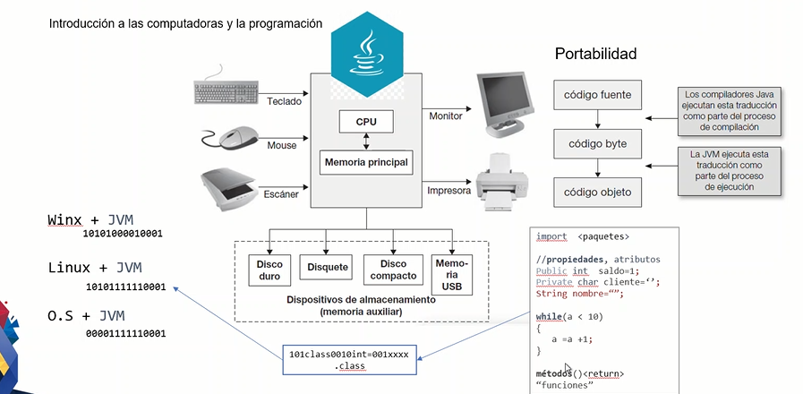


  
## Algoritmia
es la forma de como yo entender y plantear una manera de solucion de un conficto, mendiante muchos metodos y codigos.
Ejemplo :  
- Algoritmo (pseudocodigo)
- Diagrama de Flujo
- Codigo
- ( Traza) TRace  : para pruebas de escritorio  
  
    ## Para hacer valores pares e impares  
  **utilizando if, for and else**
  si yo doy un n que va a leer entonces, declaramos lo siguiente :  
  ```java
  for ( int n = 9 ){
    if (n% 2 == 0) {  
      system.out.print("+")
    }else{
  system.out.print("-")
  }
  }
  ```

  para un for :
  **donde en for ( declaro una variable que comienza, tener una restriccione que sea menor a mi numero que digite y la forma de como crece esta variable a variar)**
  ```java
  int n = 7  
  for ( int i = 0 ; i < n ; i = i +1 ){
    if ( n % 2 == 0 ){
      system.out.print("+"){

      }else{
        system.out.print("-")
  
      }
    }
  }
  ```

  ## Pasos de condicionales para crear un FlujoGrama
  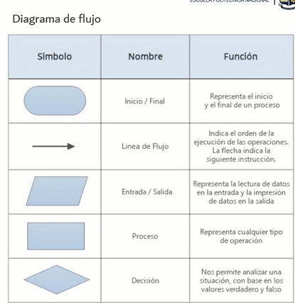


## Diagrama de Flujo del prj -> POO INTRO 20/04
Un diagrama de flujo es para graficar un algoritmo o una estructura en una serie de pasos y vinculados que permiten su revision como un todo del proyecto.  
cada figura geometrica representa cada paso  puntual del proceso que esta puntuado a evalucacion, que se conectan entre si.  

### hay varias formas de representar un diagrama de flujo :  
- vertical
- horizontal
- panoramico  
- Arquitectónico

**donde su forma de esquematizar sea a travez de un INICIO y un FINAL**

donde;  


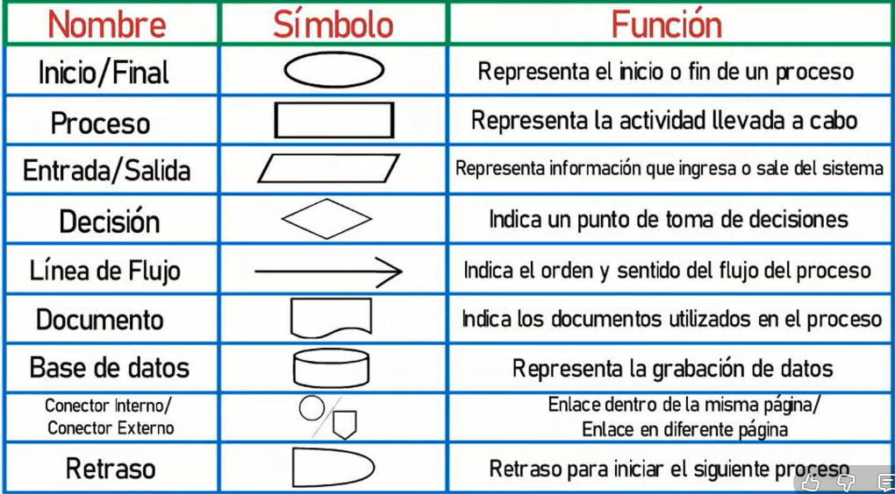


  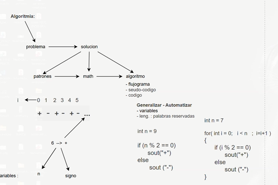

  ## FlujoDrama o Diagrama de Flujo
  para poder organizar las ideas de mi programa de manera mas grafica y de manera mas practica ;

  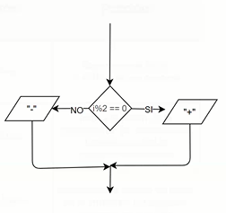

## Para poder un prj bien proyectado y explicativo en su creacion -> proyectos java 21/04

***donde tenemos varias clases en un mismo prj, para mayor facilidad de trabajo tenemos un controlador.java que nos ayude a detectar a las demas clases excepto la clase que tenga el main o conocido como el puerto de entrada y salida (public static void)***

Para un uso adecuado de clases que forman parte de un proyecto, nosotros necesitamos que alguien guíe o direccione a estos documentos de manera adecuerda y ordenada con finalidad de mantener un repositorio y trabajo ordenado, tambien llamadado la clase "**Controlador.java**", este nos ayuda a dirigir nuestros documentos de manera logica y coherente, siendo asi en nuestro metodo main sea mas limpio y concreto.

como en este caso, tenemos al metodo Controlador, llamando los metodos de las demas variables al metodo main

```java  
public class controlador{
    public void ShowSerieCaracterAlterno (int cantidad){
        SerieCaracter serie = new SerieCaracter();
        System.out.println("Serie de caracteres alternos:");
        serie.PresentarSerieCaracterAlterno(8);
    }

    public void ShowSerieNumerica (int cantidad){
        SerieNumerica serie = new SerieNumerica();
        System.out.println("\nSerie de numeros alternos:");
        serie.MostrarSerieNumerica(8);
    }
}
```

### forma de documentar y de comentar  
``` java  
public class SerieNumerica(){

  /***
   * esta es una forma de documentar con java
   */

  // esto sirve para comentar
}
```

## Atributos y Propiedad -> 22/04
Donde puede ser que tengamos un Main base fuera de los packages, para poder programar tenemos que tener en cada cierta clases lo siguiente estructura:  
- propiedad/atributo : son sustantivos calificadores para proporcionar la propiedad, (Calificativo, Cuantificador)  
- Metodo : normalmente se clasifica por ser un verbo en infinitivo (-ar , -er , -ir)  
- Nombre de la case : normalmente es un sustantivo o un objeto que simula el mundo real
### Nombre  
se reconoce desde el nombre del doc como un temrinacion .java  .ipynt

### Variables
- int
- float
- double
- String
- boolean

### Propiedad
donde se puede reconocer public de forma global
donde tiene varias formas  
- public
- protected
- private

### Metodos
tenemos varios que por las cuales tenemos que algunos que retornan en valor u otros que no lo hacen.
los que no retornan valor tambien conocidos los tipo **void**
(parameters){body}
```java
- parametros
<public/protect/private> void NombreMeotodo(){body}

parametros
<public/protect/private> void NombreMetodo(para1,para2, ..) [body]

retorno  
<public/protect/private> <TipoDato> NombreMetodo(){body

return <TipoDato>}


retorno con parametro  
<public/protect/private> <TipoDato> NombreMetodo (param1 , param2 , param3){
  body  

return <TipoDato>
}
```
``` java
public void MostrarDato();{
  ...
}
```

tenemos los que retornan valor que tambien conocidos como tipo **variable (int, doble, String)**

```java  
public int MostrarDato(){
  ...
  return (variable) int  
}

public String MostrarDato(){
  ...
  return String  
}
```

## Actividades y POO -> 27/04
**tipo de datos y variables**
tipo de variables primitivas y las variables llamas por referencia o no primitivas.

las **variables primitivas** conditions ( nombre de la variable, abreviaciones, no numericos, **camelcase**)
siempre variables primitivas inicial con **Minusculas**

las **variables no-Primitivas** (son valores cuya informacion mas extensa, comienza con **Mayuscula** )
son String,Arrays,Classses,Enums and Records

```consola
-primitivas  
int  
chat  
float  

-no primitivas
Integer
Char
String
Float
Datatime
```
Cast or casting : una forma de transformar variables o una forma de coordialidad para cambiar un tipo de variable no comun.


## POO BASIC -> 28/04
- if : bloque de codigo que sirve para dar excepciones, si especifica una condicion es verdadera.
- else : bloque de codigo que parte de if, es para la expcecion si no cumploe con la condicion de verdadero siendo falso.  
- else if : cuando existe estas excepciones es por la cual quiere agregar mas booleans siendo asi una nuevo condicion de texto, cuando la primera condicion es falsa.
- switch : bloque de comando o cidogo para alternar bloques de codigos agregados con excepciones  
- ? : para utilizar especialmente en una sola linea de condicion  

## AFD -> 04/05
un automata finito deterministico, nos dice que se puede objetener de una serie o de un codigo varias entradas mas no solo una determinada, donde puede a ver varios estados, donde tambien se contempla su alfabeto y sobre todo los estados de inicio y final del automata, que procesa una cadema de simbolos de manera determinada
- q : conjunto de estados que tiene el automata
- Σ : es el alfabeto de entrada, o conocido como el conjunto de simbolos finitos que el automata puede desarrollar
- q0 : es el estado inicial donde nuestro automata comienza  
- δ : los estados de transcion que tiene el automata  
- F o qf : donde es el ultimo estado de nuestra cadena de caracteres determinada y aceptada  
- tambien se determina los movimientos del automata o de las cademas aceptadas mediante una tabla de transiciones  

para mayor interaccion o en la creacion de los AFD de manera digital, podemos realizar mediante el portable **JFLAP** que nos permite realizar, ya se utilizando todas las caracteristicas ademas como un modelo muy limpio y organizado en obtenerlo.  
  
  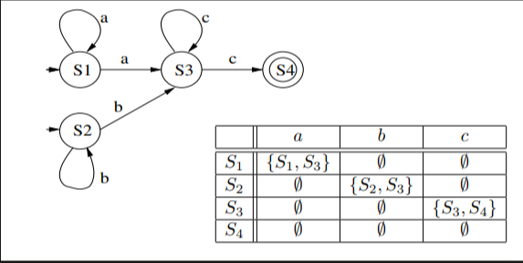

  ## TRABAJO EN DIFERENTE PC  
  Otra PC:
- git clone
- git add .
- git commit
- git push

PC de casa:
- git pull

## Preview Exam
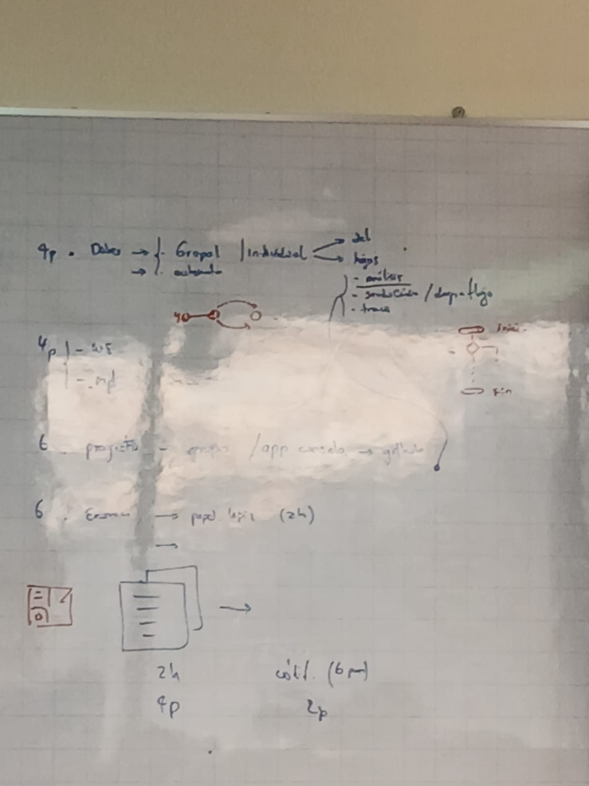
---

---
# Segundo Bimestre


